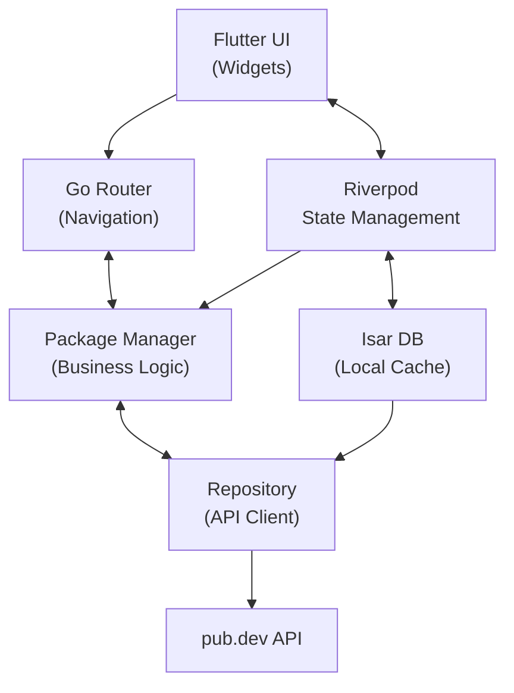
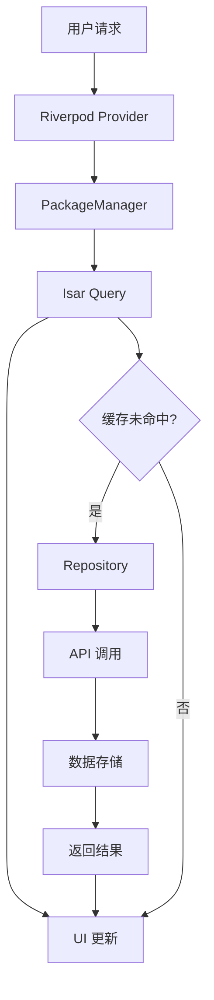
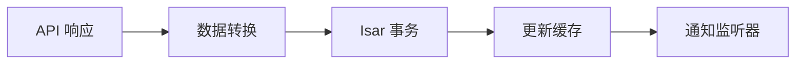

# 第 1 章 项目概述和架构设计

## 引言

在本章中，我们将深入剖析 pub.dev 客户端示例项目的整体架构和设计理念。这个项目展示了如何使用 Isar 构建一个功能完整的离线优先应用程序。

## 项目目标

构建一个能够：

- **离线优先**：即使在没有网络连接的情况下也能正常使用
- **高性能**：快速的数据查询和响应
- **用户友好**：直观的界面和流畅的交互体验
- **数据完整性**：可靠的数据同步和缓存机制

## 核心功能特性

### 📦 包信息浏览

- 查看包的详细信息、版本历史和依赖关系
- 显示包的评分、受欢迎度和下载统计
- 支持包的文档和主页链接

### 🔍 智能搜索

- 实时搜索包名称和描述
- 支持在线和离线搜索模式
- 分页加载和结果排序

### 💾 离线数据缓存

- 自动缓存已浏览的包信息
- 智能的数据更新策略
- 本地数据优先的读取机制

### 📱 响应式界面

- 支持深色/浅色主题切换
- 适配不同屏幕尺寸
- 流畅的页面导航和转场动画

## 技术架构概览



## 架构分层设计

### 1. 数据层 (Data Layer)

**Repository (数据仓库)**

- 负责与 pub.dev API 的通信
- 处理 HTTP 请求和响应
- 数据格式转换和错误处理

**Isar Database (本地数据库)**

- Package 集合：存储包信息和版本数据
- Asset 集合：存储包的文档和资源文件
- 支持复杂查询和索引

### 2. 业务逻辑层 (Business Logic Layer)

**PackageManager (包管理器)**

- 统一的数据访问接口
- 离线优先的数据策略
- 缓存管理和数据同步

**AssetLoader (资源加载器)**

- 异步加载包的文档和资源
- 资源缓存和优化

### 3. 状态管理层 (State Management Layer)

**Riverpod Providers**

- 全局状态管理
- 依赖注入和生命周期管理
- 响应式数据流

### 4. 表现层 (Presentation Layer)

**Flutter Widgets**

- 响应式的用户界面
- 主题和样式管理
- 导航和路由

## 数据流设计

### 读取数据流程



### 写入数据流程



## 离线优先策略

### 数据同步机制

1. **首次加载**：从 API 获取数据并缓存到本地
2. **增量更新**：只同步新增或更新的数据
3. **缓存优先**：优先使用本地缓存，提供即时响应
4. **后台同步**：在后台更新缓存数据

### 缓存策略

- **时间戳比较**：使用发布时间判断数据新鲜度
- **版本控制**：跟踪最新版本和预发布版本
- **智能清理**：自动清理过期或不常用的数据

## 性能优化考虑

### 数据库优化

- 使用适当的索引加速查询
- 批量操作减少数据库事务
- 惰性加载和分页查询

### UI 优化

- 响应式布局和高效的重绘
- 异步数据加载和错误处理
- 内存管理和资源回收

## 开发环境要求

- **Flutter SDK**: >= 3.22.0
- **Dart SDK**: >= 3.5.0
- **Isar**: 4.0.0-dev.10
- **开发工具**: VS Code 或 Android Studio

## 项目结构

```text
lib/
├── main.dart              # 应用入口
├── models/                # 数据模型
│   ├── package.dart       # 包模型
│   ├── asset.dart         # 资源模型
│   └── api/               # API 数据结构
├── ui/                    # 用户界面
│   ├── home_page.dart     # 首页
│   ├── detail_page.dart   # 详情页
│   └── search_page.dart   # 搜索页
├── provider.dart          # Riverpod 提供者
├── repository.dart        # API 客户端
├── package_manager.dart   # 数据管理器
└── asset_loader.dart      # 资源加载器
```

## 练习：架构分析

1. 分析项目的数据流向，绘制数据流图
2. 识别项目的关键组件和它们的职责
3. 思考如果要添加新功能（如用户收藏），需要在哪些层进行修改

## 小结

通过本章的学习，你应该：

- 理解项目的整体架构和设计理念
- 掌握离线优先应用的核心概念
- 熟悉项目的分层设计模式
- 了解数据流和状态管理的机制

在下一章中，我们将开始实际的代码实现，首先从项目设置和依赖配置开始。
