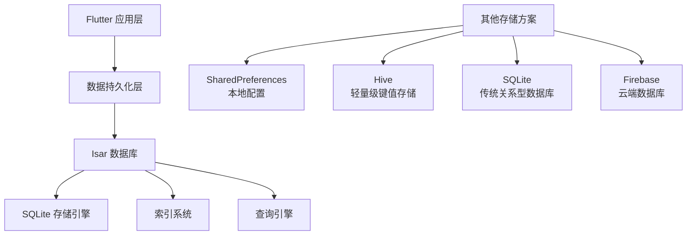
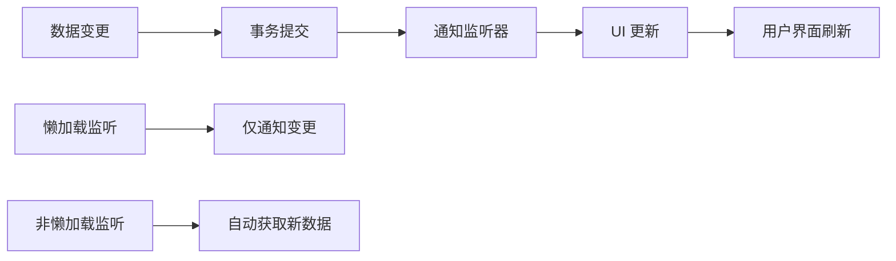
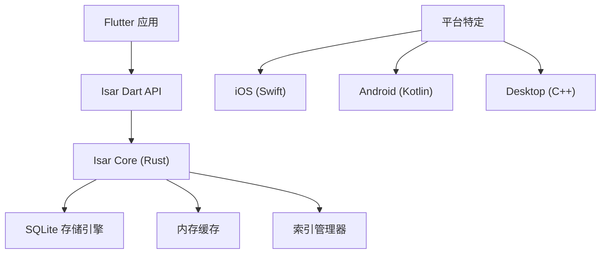

# Isar 数据库详解

## 简介与概述

### Isar 数据库是什么？

Isar 是一个专为 Flutter 设计的超高速 NoSQL 数据库。它提供了直观易用的 API，支持复杂查询、索引和实时数据监听。作为一个嵌入式数据库，Isar 直接在 Flutter 应用中运行，无需额外的服务器配置。

**核心特性：**

- 🚀 **高性能**：基准测试显示其在插入、查询和更新操作上表现优异
- 💙 **Flutter 优先**：专为 Flutter 设计，无需繁琐配置
- 📱 **跨平台**：支持 iOS、Android 和桌面平台
- 🧪 **ACID 语义**：保证数据一致性和可靠性

### Isar 在 Flutter 生态中的定位



从上图可以看出，Isar 位于 Flutter 数据持久化层的核心位置。它比 SharedPreferences 更强大，支持复杂数据结构；比 SQLite 更易用，无需手写 SQL；比 Firebase 更轻量，无需网络依赖。

## 核心概念解析

### 集合 (Collection)

在 Isar 中，集合是数据的逻辑分组，类似于传统数据库中的表。每个集合都对应一个 Dart 类，通过 `@collection` 注解标记。

**关键特性：**

- **自动模式生成**：使用代码生成器自动创建数据库模式
- **类型安全**：编译时检查，确保数据类型正确
- **嵌套对象支持**：支持复杂的数据结构

### 索引 (Index)

索引是 Isar 性能优化的核心机制。通过 `@Index` 注解，可以为字段创建索引以加速查询。

```dart
@collection
class Email {
  Email({
    this.id,
    this.title,
    this.recipients,
    this.status = Status.pending,
  });

  final int id;

  @Index(type: IndexType.value)
  final String? title;

  final List<Recipient>? recipients;
  final Status status;
}
```

### 嵌入对象 (Embedded Objects)

使用 `@embedded` 注解的类可以嵌入到其他集合中，形成复杂的数据结构。

```dart
@embedded
class Recipient {
  String? name;
  String? address;
}
```

**设计理念：**

- 嵌入对象没有独立 ID，与父对象一起存储
- 支持嵌套嵌入，形成树状结构
- 查询时可以直接访问嵌入对象的属性

### 数据库实例与事务

```dart
// 打开数据库实例
final dir = await getApplicationDocumentsDirectory();
final isar = await Isar.openAsync(
  schemas: [EmailSchema],  // 模式列表
  directory: dir.path,      // 存储目录
);
```

**事务特性：**

- **原子性**：要么全部成功，要么全部失败
- **隔离性**：事务间相互隔离
- **一致性**：数据始终保持一致状态
- **持久性**：提交的数据永久保存

## CRUD 操作详解

### 创建操作 (Create)

```dart
final newEmail = Email(
  title: 'Amazing new database',
  status: Status.pending,
);

// 异步写入事务
await isar.writeAsync(() {
  isar.emails.put(newEmail); // 插入或更新
});
```

**操作机制：**

1. 创建 Email 对象实例
2. 在写事务中调用 `put()` 方法
3. Isar 自动分配 ID 并持久化数据

### 读取操作 (Read)

```dart
// 根据 ID 获取单个对象
final existingEmail = isar.emails.get(newEmail.id!);

// 查询多个对象
final emails = await isar.emails.where()
  .titleContains('awesome', caseSensitive: false)
  .findAll();
```

**查询构建器模式：**

- `where()`: 使用索引的条件查询
- `filter()`: 复杂的过滤条件
- `sortBy()`: 排序操作
- `limit()`: 限制结果数量

### 更新操作 (Update)

```dart
await isar.writeAsync(() {
  final email = isar.emails.get(someId);
  email?.status = Status.sent;
  isar.emails.put(email!); // 使用相同 ID 进行更新
});
```

### 删除操作 (Delete)

```dart
await isar.writeAsync(() {
  isar.emails.delete(existingEmail.id!); // 删除单个
  isar.emails.clear(); // 删除所有
});
```

## 查询系统深度分析

### 索引查询 vs 过滤查询

```dart
// 索引查询 (高效)
final importantEmails = isar.emails
  .where()
  .titleStartsWith('Important') // 使用索引
  .limit(10)
  .findAll();

// 过滤查询 (灵活但较慢)
final specificEmails = isar.emails
  .filter()
  .recipient((q) => q.nameEqualTo('David')) // 查询嵌入对象
  .or()
  .titleMatches('*university*', caseSensitive: false)
  .findAll();
```

**查询策略选择：**

- **索引查询**：适用于精确匹配、前缀匹配，性能最佳
- **过滤查询**：适用于复杂条件、正则匹配，功能最全
- **组合使用**：先用索引缩小范围，再用过滤器精确筛选

### 查询修饰符

```dart
final results = await isar.emails
  .where()
  .titleStartsWith('Work')
  .filter()
  .statusEqualTo(Status.pending)
  .sortByTitle()          // 排序
  .distinctByTitle()      // 去重
  .offset(20)             // 偏移
  .limit(10)              // 限制
  .findAll();
```

**常用修饰符：**

- **排序**：`sortByField()`, `sortByFieldDesc()`
- **去重**：`distinctByField()`
- **分页**：`offset()`, `limit()`
- **聚合**：`count()`, `isEmpty()`, `isNotEmpty()`

## 数据监听机制

### 监听器类型

```dart
// 集合级监听 (懒加载)
Stream<void> collectionStream = isar.emails.watchLazy();

// 查询级监听 (自动获取结果)
Stream<List<Email>> queryStream = isar.emails
  .where()
  .statusEqualTo(Status.pending)
  .watch();

// 对象级监听
Stream<Email?> objectStream = isar.emails.watchObject(emailId);
```

**监听机制原理：**



### 监听器的生命周期

```dart
// 创建监听器
final subscription = queryStream.listen((newResult) {
  setState(() {
    emails = newResult;
  });
});

// 清理资源
@override
void dispose() {
  subscription.cancel();
  super.dispose();
}
```

**最佳实践：**

- 在 `initState` 中创建监听器
- 在 `dispose` 中取消订阅
- 使用懒加载监听器减少不必要的查询
- 合理设计查询条件，避免过度监听

## 架构设计与性能优化

### Isar 架构概览



### 性能优化策略

#### 1. 索引优化

```dart
@collection
class Product {
  @Index(type: IndexType.value)  // 值索引
  String? name;

  @Index(type: IndexType.hash)   // 哈希索引 (精确匹配)
  String? category;

  @Index(composite: [CompositeIndex('price'), CompositeIndex('category')])
  // 复合索引
  double? price;
}
```

#### 2. 查询优化

- 优先使用索引查询而不是过滤查询
- 合理使用复合索引
- 避免在循环中进行数据库查询

#### 3. 事务优化

```dart
// 批量操作
await isar.writeAsync(() {
  for (final item in items) {
    isar.items.put(item);
  }
});
```

## 单元测试与开发实践

### 测试环境设置

```dart
// 测试前初始化
await Isar.initializeIsarCore(download: true);

// 创建内存数据库用于测试
final isar = await Isar.openAsync(
  schemas: [EmailSchema],
  directory: '',  // 空字符串表示内存数据库
);
```

**测试注意事项：**

- 使用 `flutter test -j 1` 避免并行下载冲突
- 为每个测试创建独立的数据库实例
- 测试后及时清理资源

### 常见使用模式

#### 1. 仓库模式 (Repository Pattern)

```dart
class EmailRepository {
  final Isar _isar;

  EmailRepository(this._isar);

  Future<List<Email>> getPendingEmails() {
    return _isar.emails
      .where()
      .statusEqualTo(Status.pending)
      .findAll();
  }

  Future<void> markAsSent(int id) {
    return _isar.writeAsync(() {
      final email = _isar.emails.get(id);
      if (email != null) {
        email.status = Status.sent;
        _isar.emails.put(email);
      }
    });
  }
}
```

#### 2. 状态管理集成

```dart
class EmailProvider extends ChangeNotifier {
  final Isar _isar;
  List<Email> _emails = [];

  EmailProvider(this._isar) {
    // 监听数据变化
    _isar.emails.watchLazy().listen((_) {
      _loadEmails();
    });
  }

  Future<void> _loadEmails() async {
    _emails = await _isar.emails.where().findAll();
    notifyListeners();
  }
}
```

## 常见问题与最佳实践

### 性能问题排查

**Q: 查询速度慢怎么办？**
A: 检查是否使用了合适的索引。优先使用 `where()` 查询而不是 `filter()`。

**Q: 数据库文件过大怎么办？**
A: Isar 自动进行数据压缩。考虑清理不需要的数据或优化数据结构。

**Q: 内存使用过多怎么办？**
A: 合理使用懒加载监听器，避免一次性加载过多数据。

### 数据迁移

```dart
// 模式变更时的数据迁移
@collection
class User {
  // 添加新字段
  @Index()
  String? email;  // 新增字段

  String? name;
}
```

**迁移策略：**

1. 添加新字段时，提供默认值
2. 重命名字段需要手动迁移数据
3. 删除字段会自动清理数据

### 错误处理

```dart
try {
  await isar.writeAsync(() {
    // 数据库操作
  });
} on IsarError catch (e) {
  // 处理数据库错误
  print('Database error: ${e.message}');
}
```

## 总结与展望

### Isar 的优势

- **开发效率**：无需 SQL，类型安全，代码生成
- **性能表现**：优秀的基准测试结果
- **生态集成**：无缝集成 Flutter 开发流程
- **跨平台支持**：一套代码，多平台运行

### 适用场景

- **移动应用**：本地数据存储，离线功能
- **桌面应用**：配置存储，缓存数据
- **物联网设备**：轻量级嵌入式数据库
- **游戏开发**：游戏状态保存，高分记录

### 未来发展

Isar v4 正在积极开发中，预计将带来更多新特性：

- 改进的查询语法
- 更好的并发支持
- 增强的全文搜索功能

### 学习建议

1. **从基础开始**：先掌握 CRUD 操作
2. **深入查询**：学习索引和过滤器的使用
3. **实践项目**：在实际项目中应用所学知识
4. **性能调优**：了解索引和查询优化技巧
5. **测试驱动**：编写单元测试确保代码质量

通过本文的详细解析，希望开发者能够全面理解 Isar 数据库的设计理念、使用方法和最佳实践。Isar 以其出色的性能和易用性，正在成为 Flutter 生态中不可或缺的数据持久化解决方案。
